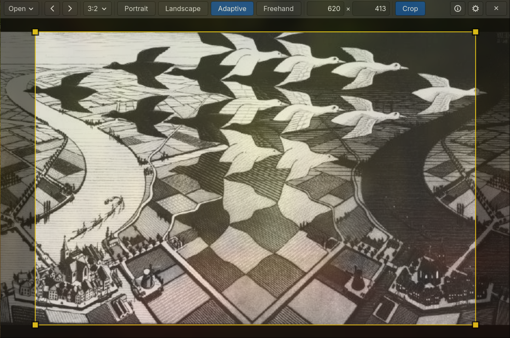

# Cropfast

If you like this project and want to support its development:

<a href="https://www.buymeacoffee.com/mirosmar">
  
</a>

A fast, keyboard-and-mouse-driven image cropping tool for Linux, built with
GTK4 / PyGObject. Designed to quickly crop a whole folder of photos to a
fixed aspect ratio (3:2, 4:3, 16:9, ...), one image after another, without
touching a mouse-driven menu for every file.



## Features

- Crop to a preset aspect ratio, or freehand
- Portrait / Landscape / Adaptive (auto-orients to each image) modes
- Batch-friendly: right-click crops and jumps to the next image
- Rule-of-thirds grid while adjusting a selection
- Remembers your output folder, ratio presets and sorting preferences
  between runs
- No personal paths hard-coded — the output folder default is resolved
  via your system's XDG user directories (`Downloads`), whatever it's
  actually named on your system/language. The input folder has no
  default at all: until you set one in Settings, the app just asks each
  time you open it

## Requirements

- Python 3.9+
- GTK 4 and PyGObject (`python3-gi`, package name varies by distro)

Debian/Ubuntu:
```bash
sudo apt install python3-gi gir1.2-gtk-4.0
```

Fedora:
```bash
sudo dnf install python3-gobject gtk4
```

Arch:
```bash
sudo pacman -S python-gobject gtk4
```

## Usage

Run directly:

./cropfast.py                      # opens with your default input folder;
                                # if there's nothing to show, the canvas
                                # prompts you to open an image or folder
./cropfast.py /path/to/photo.jpg   # open a specific image
./cropfast.py /path/to/folder      # open a specific folder


### Keyboard & mouse shortcuts

| Shortcut               | Action                              |
|-------------------------|--------------------------------------|
| `Ctrl+O`                | Open an image or folder             |
| `Enter`                 | Crop and stay on this image         |
| Right-click on image    | Crop and go to the next image       |
| `←` / `→`                | Previous / next image               |
| Mouse wheel              | Previous / next image               |
| `F`                     | Switch to Freehand mode             |
| `Esc`                    | Close the application               |

The same list is available in-app via the **?** (About) button.

## Configuration

Settings are stored in `~/.config/cropfast/config.cfg` and can be edited
either by hand or through the in-app **Settings** button (gear icon):
output folder, default input folder, ratio presets, startup mode, and
sort order/field.

## Installing as a desktop app (optional)

1. Copy `cropfast.py` somewhere on your `PATH`, e.g.:
   mkdir -p ~/.local/bin
   cp cropfast.py ~/.local/bin/cropfast
   chmod +x ~/.local/bin/cropfast
2. Edit `cropfast.desktop`: adjust `Exec=` to match where you installed it.
3. Install the desktop entry:
   cp cropfast.desktop ~/.local/share/applications/

CropFast should now appear in your application menu and as the default
handler you can pick for image files.

## License

MIT — see [LICENSE](LICENSE). Update the copyright holder name before
publishing if you'd like it under your own name.
